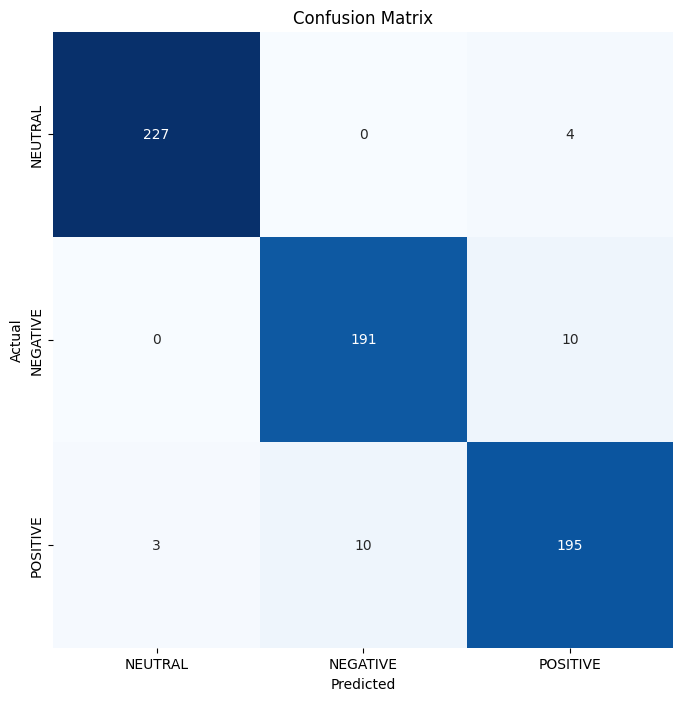

# EEG-Based Emotion Predictor
# Project Description
This project aims to predict emotional states using EEG readings recorded from subjects as they watched various movie scenes. We leveraged a dataset from Kaggle and used a TensorFlow-based neural network for our predictions. Initially, we achieved an accuracy of approximately 54% using a two-layer neural network. Given the time series nature of the data, we switched to a Recurrent Neural Network (RNN) with a GRU model, significantly improving our results.

# Dataset
The dataset used in this project is available on Kaggle: [EEG Brainwave Dataset: Feeling Emotions](https://www.kaggle.com/datasets/birdy654/eeg-brainwave-dataset-feeling-emotions). It contains EEG readings captured from subjects while they experienced various emotional states during movie scenes.

# Model Performance
By employing the GRU model, we achieved high accuracy in predicting emotions, with the following classification report:

Class	Precision	Recall	F1-Score	Support
NEUTRAL	0.99	0.98	0.98	231
NEGATIVE	0.95	0.95	0.95	201
POSITIVE	0.93	0.94	0.94	208
Overall accuracy: 96%

Macro avg: 0.96 (Precision), 0.96 (Recall), 0.96 (F1-Score)
Weighted avg: 0.96 (Precision), 0.96 (Recall), 0.96 (F1-Score)

# Confusion Matrix
The following confusion matrix illustrates the model's performance across different classes:

Conclusion
Using the GRU model, we achieved a very high accuracy, with each class scoring above 0.93. This demonstrates the model's effectiveness in predicting emotional states from EEG readings.

